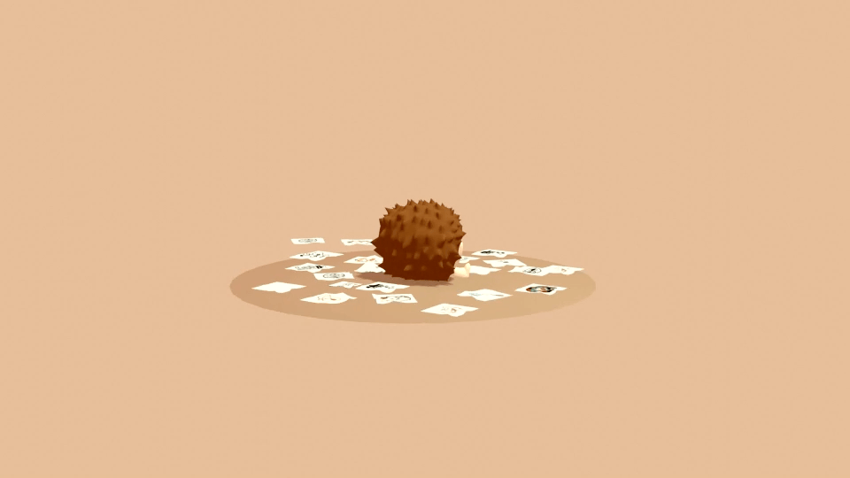
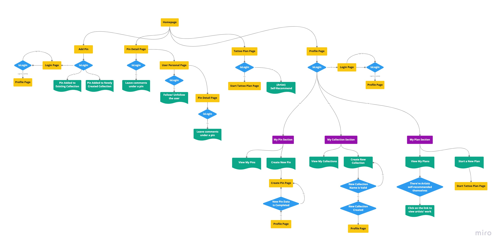
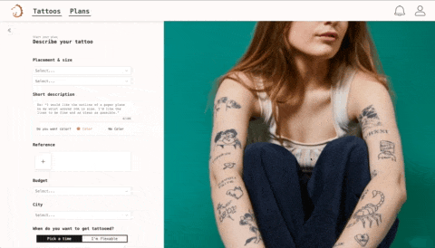
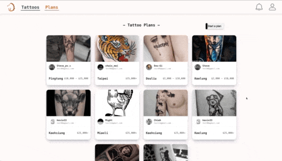

# tz tz 刺刺

__A tattoo-sharing platform that inspires people with tattoo ideas and matches them with the right artists__

## About The Project
Because getting a tattoo should be a great experience. tztz provides various tattoo ideas and categorizes them with placements, styles, and topics, allowing users to save tattoo pins into the collections they've created. Moreover, users could start their own tattoo plans by specifying the placement, size, color, budget, and most importantly, selecting a tattoo pin they’ve saved as a reference. After a tattoo plan has been created, it shows up on the tattoo plan wall, and artists could check if any of the plans fit their professions and recommend themselves; on the other hand, users could check all the self-recommended artists on each of the tattoo plans they’ve created.

## Link
tz tz : https://tz-tz-fa8a7.web.app/

## Tech
 * Built with create-react-app, applied react-router-dom for SPA, styled with styled-components, and managed login and data with Firebase (Firestore, Storage, Authentication).

 * Implemented lazy loading with Intersection Observer API, and arranged tattoo pins display with react-masonry-css.

 * Applied react-beautiful-dnd and a self-designed calculating function to allow users to arrange images they’ve saved by dragging them to other positions.

 * Compressed uploaded image with browser-image-compression to improve render efficiency and reduce usage cost of Firebase Storage.

 * Managed frequently used data with useContext.

## Flow Chart
***

<!-- ## Demo
Various types of tattoo pins are displayed in waterfall flow; users could filter pins through placements, styles, and topics.

Users could delete a pin and arrange orders of the pins inside a collection.

By selecting details for the next tattoo, users could create a tattoo plan.

Artists could click on tattoo plans to view more details and recommend themselves.

## Future Features
 * Add introdction section, site link, studio map on artists personal page.

 * Allow user to share pins and artist's personal page link.

 * Allow users to report irrelevant or inappropriate pins.

## Contact
 * Name: Kevin P.H. Chiou
 * E-mail: kevinph.chiou@gmail.com
 * LinkedIn: https://www.linkedin.com/in/kevin-chiou-435a93141/
